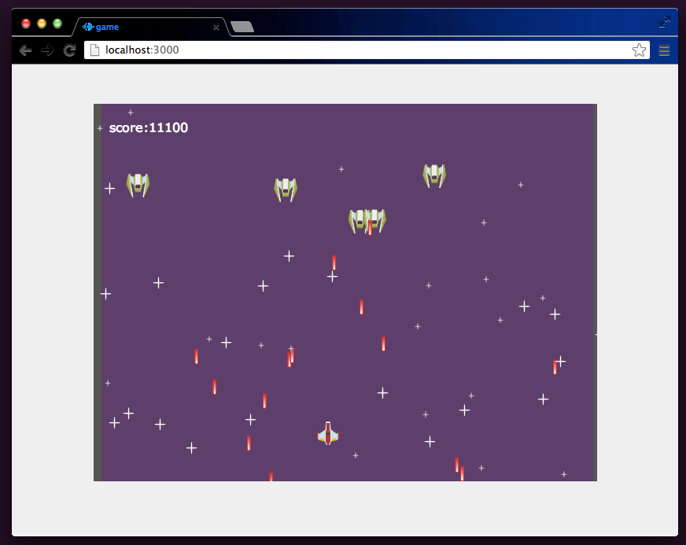

# SmoothStep2D Framework sample applications

Sample games of [SmoothStep2D Framework](http://ss2d.wordpress.com).

## Installation

    git clone https://github.com/sodesign/ss2d_samples.git

    cd ss2d_samples

    cd XX_SAMPLENAME

    npm install

    node app.js

## Samples

- [sample01](./01_ss2d_shooting/README.md)

## Screen

### sample 01

## License

This is released under the [MIT](http://opensource.org/licenses/MIT) license.

